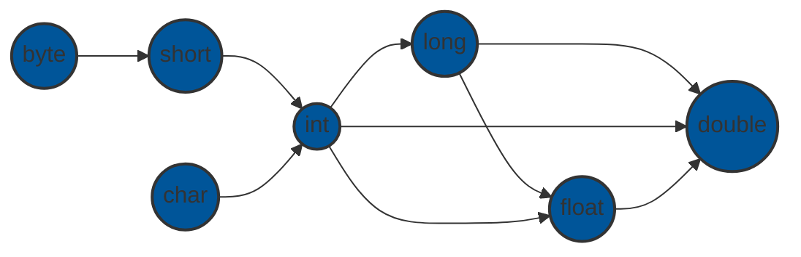

## Method Overloading

### What is Method Overloading?
The process of using the same method name with different sets of parameters is called method overloading.

### Advantages of Method Overloading
It is helpful to increase the readability of the program.

### Ways to overload method
1. By changing the number of arguments
2. By changing the data type of arguments

*It is not possible to overload methods by changing the return type of the method due to ambiguity issues.*

### Type Promotion in Method Overloading

As per the diagram above
*   The `byte` data type can be promoted to `short`, `int`, `long`, `float` or `double`.
*   The `short` data type can be promoted to `int`, `long`, `float` or `double`.
*   The `char` data type can be promoted to `int`, `long`, `float` or `double` and so on.

*Please refer to `MethodOverloading.java` for examples related to this concept.*