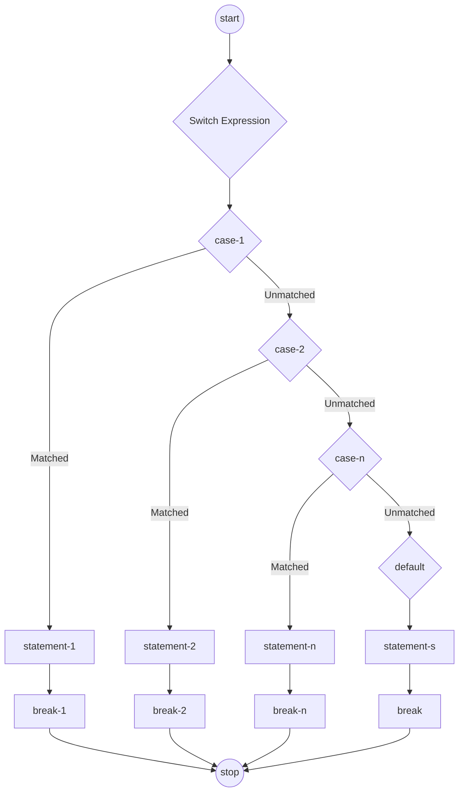

## Switch Statement

A switch statement executes one or more statements from multiple conditions. It is like the `if-else-if` statement. The
switch statement works with `byte`,`short`, `int`, `long`, `enum types`, `String` and some wrapper types like Byte,
Short, Integer and Long.

### Important points to remember:
*   A switch expression may have one or number of case values
*   The case value must be of switch expression type only
*   The case value must be a *literal* or a *constant*. *Variables* are not allowed
*   Case values must be unique. In case of duplicate values, a compile-time error is rendered
*   Each case statement can have a break statement which is *optional*
    *   If `break` is provided in a case statement, then the control exits the switch statement after the case has been
        executed
    *   If `break` is *NOT* provided in a case statement, then the control proceeds to execute the next case statement
*   The case value can have a `default` label which is optional

